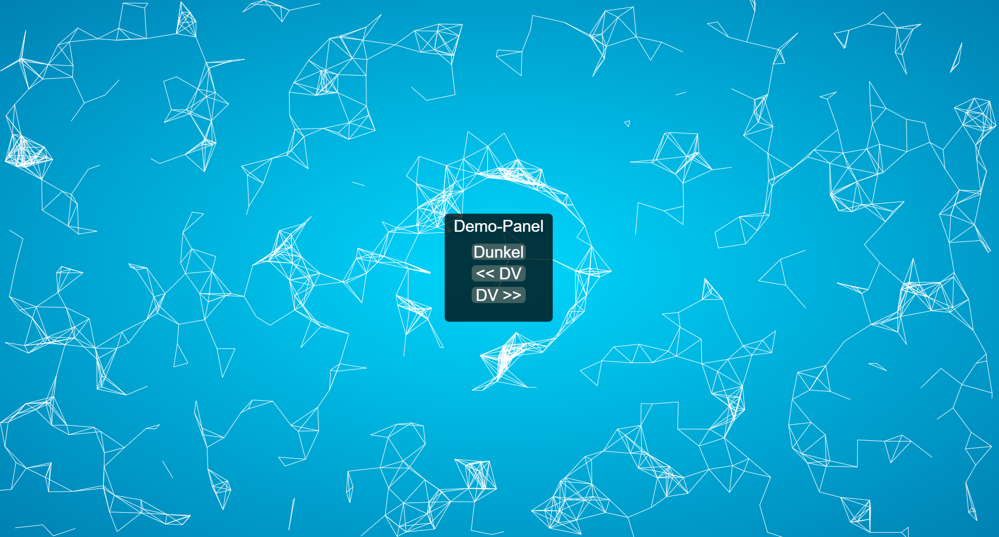
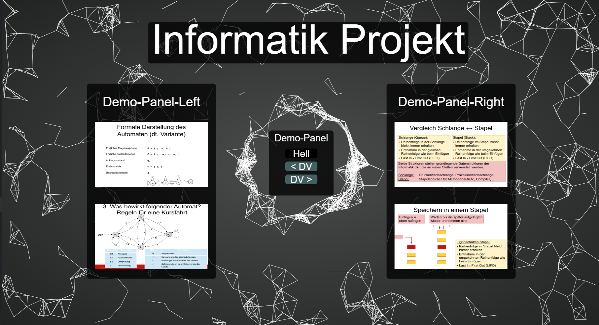

# Demo-Web-Component Library
* #### Version: 1.1 
* #### Author: [Linus Schmidt](http://github.com/Lxnus)

#### Small demo website. Demonstrating particle render system and small components' library. This library is very easy to expand. The component-library is very easy to understand. It is very easy to add new components. This framework has the option to add an animated background (particle).
##### Requirements:
* Build gui via context (2d)
* nodejs
* Add the scripts to the .html file u choose as href.
```html
// head part...
// ...
<body>
    ... scripts ...
    <script src="<name>"></script>
</body>
```

##### Build some simple components
```javascript
// Setup a panel, where we can add the components.
const panel = new Panel(
    100, // x
    100, // y
    200, // width
    200, // height
    "#000000", //black
    0.74 // alpha-value
);

// Setup components - These are for the panel.
const button = new Button(
    100, // x
    100, // y
    100, // width
    30, // height
    "#ffffff", // color
    "Demo-Button", // text
    true // center -> center of the panel (only width!)
);

const label = new Label(
    200, // x
    200, // y
    "#ffffff", // color
    30, // fontSize
    "Demo-Label", // text
    true, // center -> center of panel (only width!)
    false, // render with background?
    undefined, // background color (only needed if background = true)
    undefined // background alpha (only needed if background = true)
);

// add the component to the panel.
panel.addComponent(button);
panel.addComponent(label);

// render stuff.
function animate() {
    requestAnimationFrame(animate);
    // context stuf...
    // background animation stuff...
    // ...
    panel.update();
}

// call render method!
animate();
```
As we have might be seen, we are able to easily create components.
If we add a component (button, label, ...), the panel auto. refactor the coords.
of the component, if they are out of box (out of the panel size);
We have the option to 'center' a component. That means, that they are rendered in
the middle of the x-axis in the panel.


#### Standalone components
Components are NOT only available for panels. They can be rendered normal onto the web-screen
without defining a panel. They are standalone. 
```javascript
const button = new Button(
    100, // x
    100, // y
    100, // width
    30, // height
    "#ffffff", // color
    "Standalone-Button", // text
    undefined // center -> center of the panel (only width!)
);

// render stuff.
function animate() {
    requestAnimationFrame(animate);
    // context stuf...
    // background animation stuff...
    // panel stuff...
    button.update();
}
```
The only difference is, that the components are not added to the panel.

#### Animated background
```javascript
let particles;
const animatedBackground = new ParticleBackground();

// for feature rendering (see below)
let index = 0;
let rotate = false;
let lastReInit = performance.now();

function animate() {
    requestAnimationFrame(animate)
    context.clearRect(0, 0, innerWidth, innerHeight);
    
    // do amazing stuff with animation:
    // not important for rendering (only a feature)
    if(rotate && index >= 45) {
        animatedBackground.init();
        rotate = false;
        index = 0;
    }
    if(rotate) {
        if(animatedBackground.check(lastReInit, 0)) {
            lastReInit = performance.now();
            index++;
        }
    } else {
        if(animatedBackground.check(lastReInit, 20000)) {
            lastReInit = performance.now();
            rotate = true;
        }
    }
    
    // update particles
    for(let i = 0; i < particles.length; i++) {
        particles[i].update();
    }
    animatedBackground.connect();
}
```

## Demos
### Light Theme (without demo-panel)


### Dark Theme (with demo-panel)


#### TODO
- [x] Implement button, label
 
- [x] Fix image issue 
 
- [ ] Implement more components (image, video, slider, etc)
